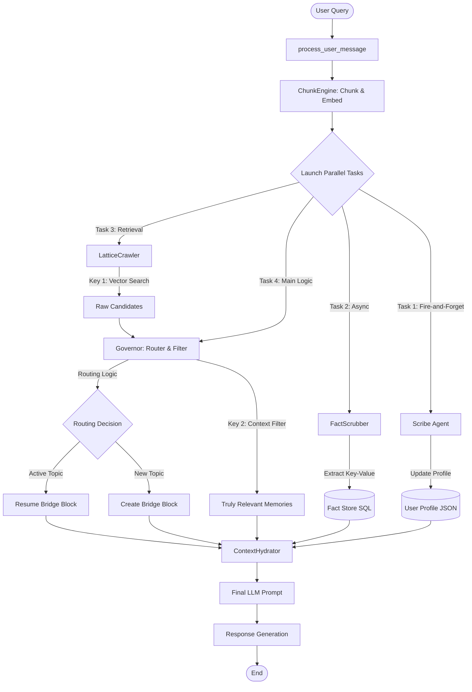

HMLR — Hierarchical Memory Lookup & Routing

A state-aware, long-term memory architecture for AI agents with verified multi-hop, temporal, and cross-topic reasoning guarantees.

HMLR replaces brute-force context windows and fragile vector-only RAG with a structured, state-aware memory system capable of:

resolving conflicting facts across time,

enforcing persistent user and policy constraints across topics, and

performing true multi-hop reasoning over long-forgotten information —
while operating entirely on mini-class LLMs.

*HMLR is the first publicly benchmarked, open-source memory architecture to achieve perfect (1.00) Faithfulness and perfect (1.00) Context Recall across adversarial multi-hop, temporal-conflict, and cross-topic invariance benchmarks using only a mini-tier model (gpt-4.1-mini).

All results are verified using the RAGAS industry evaluation framework.
Link to langsmith records for verifiable proof -> https://smith.langchain.com/public/4b3ee453-a530-49c1-abbf-8b85561e6beb/d

🏆 Verified Benchmark Achievements (RAGAS)

| Test Scenario                                  | Faithfulness | Context Recall | Precision | Correct Result |
|----------------------------------------------------------------------|------|------|------|------------------|
| 7A – API Key Rotation (state conflict)                               | 1.00 | 1.00 | 0.50 | ✅ XYZ789       |
| 7B – "Ignore Everything" Vegetarian Trap (user invariant vs override)| 1.00 | 1.00 | 0.88 | ✅ salad        |
| 7C – 5× Timestamp Updates (temporal ordering)                        | 1.00 | 1.00 | 0.64 | ✅ KEY005       |
| 8 – 30-Day Deprecation Trap (policy + new design, multi-hop)         | 1.00 | 1.00 | 0.27 | ✅ Not Compliant|
| 2A – 10-Turn Vague Secret Retrieval (zero-keyword recall)            | 1.00 | 1.00 | 0.80 | ✅ ABC123XYZ    |
What These Results Prove

These five hard-mode tests cover the exact failure modes where most RAG and memory systems break:

- **Temporal Truth Resolution**: Newest facts override older ones deterministically
- **Scoped Secret Isolation**: No cross-topic or cross-block leakage  
- **Cross-Topic User Invariants**: Persistent constraints survive topic shifts
- **Multi-Hop Policy Reasoning**: 30-day-old rules correctly govern new designs
- **Semantic Vague Recall**: Zero keyword overlap required

Achieving 1.00 Faithfulness and 1.00 Recall across all adversarial scenarios is statistically rare. Most systems score 0.7–0.9 on individual metrics, not all simultaneously.





Tests:
All of the RAGAS tests can be found in the tests folder for ease of running at own convenience.
command needed similar to : \HMLR\tests; pytest ragas_test_8_multi_hop.py -v -s


⚖️ About the Precision Scores

While Faithfulness and Recall are perfect (1.00), Context Precision ranges from 0.27–0.88.
This is intentional: HMLR retrieves entire Bridge Blocks (5–10 turns) instead of fragments, ensuring no critical memory is omitted. This prioritizes governance, policy enforcement, security, and longitudinal reasoning over strict token minimization.

HMLR explicitly prioritizes Recall Safety, Temporal Correctness, and State Coherence over aggressive token minimization.

🚀 Architecture > Model Size (Verified)

All benchmarks above were executed with:

gpt-4.1-mini

< 4k tokens per query

No brute-force document dumping

No massive context windows

These results empirically validate the core thesis behind HMLR:
Correct architecture can outperform large models fed with poorly structured context.

🧠 Why HMLR Is Unusual (Even Among Research Systems)

Most memory or RAG systems optimize for one or two of the following:

retrieval recall,

latency,

or token compression.

Very few demonstrate all of the following simultaneously:

✔ Perfect faithfulness

✔ Perfect recall

✔ Temporal conflict resolution

✔ Cross-topic identity & rule persistence

✔ Multi-hop policy reasoning

✔ Binary constrained answers under adversarial prompting

✔ Zero-keyword semantic recall

HMLR v1 demonstrates all seven.

⚠️ Scope of the Claim (Important)

This project does not claim that no proprietary system on Earth can achieve similar results. Large foundation model providers may possess internal memory systems with comparable capabilities.

However:

To the author’s knowledge, no other publicly documented, open-source memory architecture has demonstrated these guarantees under formal RAGAS evaluation on adversarial temporal and policy-governed scenarios, especially using a mini-class model.

All experiments in this repository are:

reproducible,

auditable,

and fully inspectable.

✨ What HMLR Enables

Persistent “forever chat” memory without token bloat

Governance-grade policy enforcement for agent systems

Secure long-term secret storage and retrieval

Cross-episode agent reasoning

State-aware simulation and world modeling

Cost-efficient mini-model orchestration with pro-level behavior


## 🚀 Quick Start

### Prerequisites
- Python 3.10+
- OpenAI API key (for GPT-4.1-mini)
- Optional: LangSmith API key for test result tracking

### Installation
1. Clone the repository:
   ```bash
   git clone https://github.com/yourusername/HMLR.git
   cd HMLR
   ```

2. Install dependencies:
   ```bash
   pip install -r requirements.txt
   ```

3. Set up environment variables in a `.env` file:
   ```
   OPENAI_API_KEY=your_openai_key_here
   LANGSMITH_API_KEY=your_langsmith_key_here  # Optional
   ```

### Running HMLR
Start the interactive console:
```bash
python main.py
```

### Running Tests
Run RAGAS benchmarks:
```bash
cd tests
pytest ragas_test_8_multi_hop.py -v -s  # Example: Multi-hop test
```